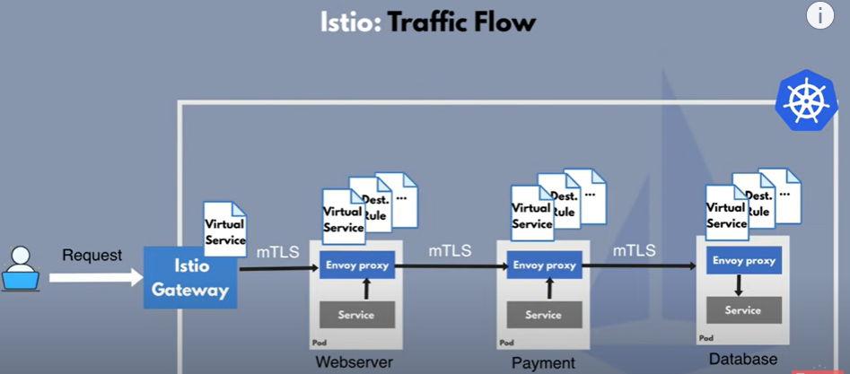

# Service Mesh File

[TOC]


The document briefly covers the use of a Service Mesh within the Helm Template.
Service mesh is an umbrella term for products that seek to solve the problems that microservices’ architectures create.

> **Note:** Service-mesh solution is only applied in the EIAP platform, where as EO platform still uses ingress controller and ingress resources for traffic routing.

Here the 3pp components that is being used to implement service mesh is [Istio](https://istio.io/latest/about/service-mesh/).




1) [Gateway](../charts/__helmChartDockerImageName__/templates/ingresses/eric-aviz-gateway.yaml): An alternative to ingress controller. This component receives all the external incoming request and redirects the traffic to designated virtual service.


2) [Virtual Service](../charts/__helmChartDockerImageName__/templates/ingresses/eric-aviz-virtualservice.yaml): All the rules for traffic re-direction are configured in virtual service. It work in conjuction with gateway for handling external traffic and route them to designated proxies.


3) Proxy: Similar to a side-car container that receives the traffic from virtual service and redirects them to the actual application container. This helps in isolating container and enhancing security. Proxies are injected inside the pod by the service-mesh controller.


4) [Destination rule](../charts/__helmChartDockerImageName__/templates/mesh-resources/eric-sm-gas-destinationrule.yaml): The destination rule is needed when there is a communication from a microservice inside the mesh to a microservice outside the mesh and mTLS enabled. And in this case (mTLS enabled) we need to distinguish if the microservice out of the mesh supports tTLS or not.


```
{{- $serviceMesh := include "eric-assurance-visualization.service-mesh.enabled" . | trim -}}
{{- $tls := include "eric-assurance-visualization.global-security-tls-enabled" . | trim -}}
{{- if and (eq $serviceMesh "true") (eq $tls "true") -}}
apiVersion: networking.istio.io/v1beta1
kind: DestinationRule
metadata:
  name: {{ template "eric-assurance-visualization.name" . }}-<target-service>-destinationrule
  annotations:
  {{- include "eric-assurance-visualization.helm-annotations" .| nindent 4 }}
  labels:
  {{- include "eric-assurance-visualization.labels" .| nindent 4 }}
spec:
  host: <target-host-name>
  trafficPolicy:
  portLevelSettings:
  - port:
      number: <target-port-number>
    tls:
      mode: MUTUAL
      clientCertificate: /etc/istio/tls/cert.pem
      privateKey: /etc/istio/tls/key.pem
      caCertificates: /etc/istio/tls-ca/cacertbundle.pem
{{- end }}
```


- In the example Gateway above, lets assume we want to add access towards a target microservice named health-checker.
- The port number that should be accessed is port: 3001
- The connection will be made using TLS in a mutual mode.


The sample output would look like as below:

```
spec:
  host: health-checker
  trafficPolicy:
  portLevelSettings:
    - port:
        number: 3001
      tls:
        mode: MUTUAL
        clientCertificate: /etc/istio/tls/cert.pem
        privateKey: /etc/istio/tls/key.pem
        caCertificates: /etc/istio/tls-ca/cacertbundle.pem
```


In the example above, we can see a list of parameters that are needed when creating a ConfigMap file:

| Parameter   | Description                                                                                                 |
|-------------|-------------------------------------------------------------------------------------------------------------|
| apiVersion  | What version of the Kubernetes API you're using to create the Object                                        |
| kind        | "Virtualservice" is kind of CRD, or in other words an extendable plugin offered by Kubernetes.              |
| metadata    | Data that helps uniquely identify the object (Could include name, UID, namespace, labels, annotations etc.) |
| spec        | Contains the keys that are required to define the set of rule.                                              |


| Parameter      | Description                            |
|----------------|----------------------------------------|
| ports          | FQDN of the micro-service              |
| Traffic policy | Applies to ports listed underneath it. |


| Parameter      | Description                                                                                                     |
|----------------|-----------------------------------------------------------------------------------------------------------------|
| host           | FQDN of the target micro-service                                                                                |
| Traffic policy | Applies to ports listed underneath it.                                                                          |
| tls mode       | if mode: DISABLE, no other parameters to mention. If mode: MUTUAL, mention the certificate files as shown below |


> **Note:** To learn more about the use of destination rules, please refer to the following [Istio Documentation](https://istio.io/latest/docs/reference/config/networking/destination-rule/).


Service mesh is enabled at the product level (base platform) and the relevant entries needs to be done at gotmpl file.
The .gotmpl file also includes the version of service-mesh.

Location of the .gotmpl file in product helmfile is under [values-templates](https://gerrit.ericsson.se/plugins/gitiles/OSS/com.ericsson.oss.eiae/eiae-helmfile/+/refs/heads/master/helmfile/values-templates/) folder.